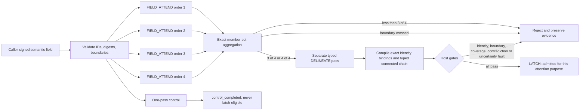

# Cantor Field Attention Cycle P0

This prototype turns the user’s “unorganized soup” intuition into a bounded executable experiment: several receptive passes may propose a whole-field identity set without privileging one serial path; a separate pass articulates typed relations; deterministic Rust gates decide whether that structure may be latched for the current attention purpose.

The implementation uses unmodified llama.cpp through its ordinary loopback OpenAI-compatible chat-completions API. It does not access hidden attention, KV cache, logits, or model memory. `admitted_for_attention` means only that a typed proposal passed this local contract.

## Governing flow



## Model/host boundary

Profile `cantor-field-attention-requests/0.5` is deliberately small.

The model supplies:

- a provisional member-ID set for each field pass;
- a provisional assessment and optional flagged IDs;
- one exact ordering of the converged candidate;
- one typed relation kind for each adjacent pair;
- explicit candidate IDs marked contradictory, excluded, or uncertain.

The host supplies and verifies:

- field membership, content digests, exact probe orders, and request schemas;
- deterministic 3-of-4 exact-set aggregation;
- exact identity self-bindings and the adjacency projection selected by the model ordering/kinds;
- hard co-membership and relation boundaries;
- complete relation coverage and graph connectivity;
- contradiction, exclusion, and uncertainty gates;
- replay lineage from each exact request and response to every stored probe, proposal, decision, and fault;
- exact state-path evidence labels, so a nonblank but substituted transition reference fails replay.

Compiler-generated accounts describe the mechanical transform. They are not presented as model-authored explanations.

Verifier output separates report validity from evidence strength:

- `deterministic_construction` reconstructs the exact host fixture;
- `stored_provider_replay` reconstructs a completed, rejected, or control path from retained provider exchanges;
- `response_backed_fault_replay` recomputes a fault from its retained failed provider response;
- `structural_runtime_fault_only` validates a canonical runtime-fault trajectory but does not claim its unretained external cause was replayed.

These assurance classes describe retained evidence, not truth or external-world attestation.

## CLI

Build and inspect the contract:

```powershell
cargo build -p cantor_field_cycle --release
target\release\cantor_field_cycle.exe contract
target\release\cantor_field_cycle.exe field-digest experiments\cantor_field_cycle_p0\attention_cycle_field.json
```

Create a deterministic offline fixture without a model:

```powershell
target\release\cantor_field_cycle.exe fixture `
  experiments\cantor_field_cycle_p0\attention_cycle_field.json `
  experiments\cantor_field_cycle_p0\my_fixture_report.json
```

Run the full loop against a loopback llama.cpp server:

```powershell
target\release\cantor_field_cycle.exe run `
  --field experiments\cantor_field_cycle_p0\attention_cycle_field.json `
  --out experiments\cantor_field_cycle_p0\my_live_report.json `
  --base-url http://127.0.0.1:8081 `
  --model MODEL_ID
```

Run the one-pass non-latch control:

```powershell
target\release\cantor_field_cycle.exe control `
  --field experiments\cantor_field_cycle_p0\attention_cycle_field.json `
  --out experiments\cantor_field_cycle_p0\my_control_report.json `
  --base-url http://127.0.0.1:8081 `
  --model MODEL_ID
```

Replay any complete, rejected, control, or response-backed fault report:

```powershell
target\release\cantor_field_cycle.exe verify experiments\cantor_field_cycle_p0\evox2_live_v5.json
```

Audit the frozen source, proof, acceptance, cost, and deployment identities without provider inference or external effects:

```powershell
.\scripts\audit_cantor_field_attention_closure.ps1
```

Audit requirement coverage, plan completion, fault/residual classification, deployment-observation binding, and the P1 non-authority boundary:

```powershell
.\scripts\audit_cantor_field_attention_requirement_coverage.ps1
```

Run the complete local checkpoint in one command, optionally adding the read-only EVO-X2 deployment audit:

```powershell
.\scripts\audit_cantor_field_attention_checkpoint.ps1
.\scripts\audit_cantor_field_attention_checkpoint.ps1 -IncludeEvox2
```

The EVO-X2 form first requires the exact pinned SHA-256 of `checkpoint_audit_v1.json`, then requires structural equality with that receipt. A changed receipt, requirement disposition, residual set, verifier identity, report set, or deployment observation fails instead of silently refreshing the baseline.

When EVO-X2 is reachable, re-observe the deployed h8 bytes, replay all 31 remote reports, confirm the pinned llama.cpp process/listener, and expose the deployment ACL without writing remote state:

```powershell
.\scripts\audit_cantor_field_attention_evox2_deployment.ps1
```

The live audit intentionally returns `passed_with_open_acl_residual` while the inherited executable ACL grants `Authenticated Users` `Modify, Synchronize`. It requires every remote report to equal its tracked local bytes and hashes h8 before and after replay. Exact bytes at observation time are still deployment content evidence, not proof that the directory is a protected production trust root.

Supply `--model` for evidence-producing runs. The optional discovery path calls `/v1/models` before a `CycleReport` exists; discovery failure currently returns a nonzero process error without a replayable report. Also use each declared CLI option exactly once: strict rejection of trailing and duplicate arguments is a successor hardening requirement.

Output files are create-new: an existing report is never overwritten. The runtime accepts ordinary loopback HTTP URLs only.

The verifier applies the same provider-identity boundary to every terminal class, including response-less transport faults: run and model identities must be nonempty, request profiles must be recognized, and non-fixture endpoints must be canonical loopback HTTP base URLs.

## Resource budgets

P0 counts exact UTF-8 bytes and never truncates accepted data. IDs are limited to 256 bytes; subject and purpose to 4096 bytes each; each element payload to 16384 bytes; source references to 2048 bytes; and boundary reasons to 4096 bytes. Semantic-field files are rejected above 524288 bytes before deserialization, and report files above 16777216 bytes. Provider connections have a 5-second deadline, whole requests a 90-second deadline, and each response a 1048576-byte ceiling with no retry. Proxy use and redirect following are disabled. A non-success response preserves status, byte count, and body SHA-256—not arbitrary body text. The `contract` command exposes these values.

## EVO-X2 evidence

The campaign used the existing Qwen3.5-0.8B Q4_0 server on `127.0.0.1:8081`. Its PID and creation time were identical before and after every run; no llama.cpp binary, model, configuration, or persistent process was changed.

| Evidence | Disposition | What it established |
| --- | --- | --- |
| `evox2_live_v1.json` | rejected | Open account/uncertainty text collapsed into repeated filler; latch refused. |
| `evox2_live_v2.json` | rejected | Prompt wording alone did not repair filler and self-relation behavior. |
| `evox2_live_v3_fault.json` | faulted | A finite enum schema without array maxima permitted repeated constrained output to token exhaustion. |
| `evox2_live_v4_fault.json` | faulted | Bounded arrays worked; strict member attribution exposed an under-delineated whole-proposal conflict. |
| `evox2_live_v5.json` | completed | Four exact probes, separate typed delineation, connected identity-preserving chain, all host gates passed. |
| `evox2_control_v5.json` | control_completed | One ordinary pass selected the same members but produced no candidate or latch. |
| `evox2_hostile_boundary_v5.json` | rejected | Four convergent probes could not override a host `forbid_co_membership` boundary. |
| `evox2_forbidden_relation_v1.json` | rejected | The model avoided the single prohibited kind and rejected its own delineation; no host relation conflict was claimed. |
| `evox2_forbidden_relation_all_kinds_v1.json` | rejected | The model returned `supported`, but its adjacent edge crossed a declared relation boundary and the host emitted `boundary_conflict`. |

The completed v5 report has canonical replay SHA-256 `ac2a07ac0b25267e16eefa68b56eb76ea08afd502ac9a555cc311de8eb0d204c`. The control replay is `83a8450d88147acd0b93db1a7952955084d6736e9aa04e3e7a1d51d1bcbff599`; hostile-boundary replay is `6d57cd6fd9a0366b9f69105e30bc97be3e504bbd4af15968af3a9b47b931907e`.

The identity-hardened repeatability campaign adds thirteen reports: five positive runs completed with the same candidate and relation sequence, five controls remained latch-ineligible, and three hostile runs were rejected before candidate creation. The same hardened executable replayed those thirteen plus all seven historical provider reports directly on EVO-X2. All twenty positive probe responses still say `conflicted`; repeatability therefore strengthens structural mechanism evidence and not semantic correctness.

The resource-bounded h2 executable repeated one positive, one control, and one hostile run. Network-closed h3 repeated all three after proxy and redirect removal. h4 moved the sequential CLI from a multithread scheduler to Tokio’s current-thread runtime, reducing the binary by 171520 bytes (about 5.7%), and repeated all three cases again. h5 binds exact event evidence-reference trajectories; h6 adds machine-visible assurance; h7 advertises the closed assurance vocabulary. Final h8 adds same-handle ceiling-plus-one local file reads and replayed all thirty-one provider reports as twenty-nine stored-provider and two response-backed-fault records without making a provider inference call. Every created report self-verified before create-new publication, while llama.cpp PID 12780 and its creation value remained unchanged.

The h8 SHA-256 is deployment content identity, not a reproducible-build claim. A whole-workspace release and multiple package-only builds produced different Windows PE hashes; the observations are retained in the deployment manifest, and deployed h4 through h8 files retain their recorded identities.

## Observed cost

Across nine completed typed cycles, each run used five exchanges, 2455 prompt tokens, and 2751–2761 total tokens; provider-reported compute ranged from 5.012 to 7.865 seconds. Nine controls used one exchange and exactly 496 total tokens, with 0.808–1.221 seconds reported compute. Seven co-membership boundary rejections stopped after four probes at exactly 2245 tokens, before paying for delineation. The two early free-text profiles consumed 3112–3293 tokens and about 13.7–14.0 seconds before rejection. Two later relation-boundary runs pay for delineation because the forbidden relation can only be evaluated after typed edges exist. These figures describe this model, field, server, cache state, and corpus—not general performance or semantic quality.

The effect-free closure audit reruns the cost analyzer in memory and compares the ordered identity of all thirty-one provider reports, all five class counts, and every published minimum/median/mean/maximum statistic. It does not merely trust the compact summary's own digest.

Local semantic-field and cycle-report reads are handle-bound and allocation-bounded: metadata is checked on the opened file, then at most the declared ceiling plus one sentinel byte is read before deserialization. A growing or path-replaced input therefore cannot force an unbounded `fs::read` allocation before the limit is enforced.

## Limits

- The four probes are correlated outputs from one model, not independent witnesses.
- A compiled connected chain proves structural contract satisfaction, not that each relation kind is semantically correct.
- All four v5 field probes described the whole proposal as conflicted without member attribution; the separate delineation returned supported. That disagreement is preserved as a semantic-confidence warning.
- Every retained provider run uses numeric `127.0.0.1`; the accepted `localhost` spelling is not accompanied by connected-peer address attestation and should not be promoted to a production network claim.
- Report publication is create-new and preverified, but a physical write interruption can leave an invalid partial file; crash-atomic publication and durability are outside P0.
- Sanitization removes the declared private-reasoning keys recursively. It is a known-key evidence policy, not a universal confidentiality guarantee for arbitrary provider fields or ordinary content.
- The EVO-X2 h8 executable currently inherits `Authenticated Users` `Modify, Synchronize`; its exact observed digest and replay success do not make that modifiable location a production trust root.
- Model discovery failure occurs before report construction, so FADL-011 trace coverage is partial at preflight. An explicit `--model` avoids discovery only when the supplied identity is itself valid; a blank explicit model reaches report construction but makes the fault report unverifiable and unpublished.
- CLI `contract`, `field-digest`, `help`, and `verify` currently ignore trailing arguments, while `run` and `control` accept duplicate recognized options with last-value-wins semantics.
- No database retrieval, faculty loading, effects, shared inference, training, dynamic procedure creation, or production authorization is part of P0.
- This is an attention I/O co-processor mechanism test, not a small language model and not proof of “holistic cognition.”
