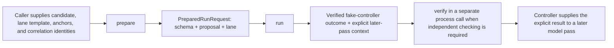

# Cantor procedure-tool experiment protocol

`cantor-procedure-experiment` is a bounded local JSON adapter over Cantor's
effectless process-procedure experiment. It is useful for controller and tool
loop experiments, but it is not a model, provider integration, resident
service, external-effect broker, or production trust authority.

## Operations

```text
cantor-procedure-experiment schema
cantor-procedure-experiment prepare [--input <prepare-request.json>]
cantor-procedure-experiment run     [--input <run-request.json>]
cantor-procedure-experiment verify  [--input <verify-request.json>]
```

`prepare`, `run`, and `verify` read standard input when `--input` is omitted.
Input must be nonempty and no larger than 16 MiB. Standard output contains
exactly one compact JSON object and a terminating newline. Diagnostics go to
standard error.

Every response states the release grade
`effectless_internal_experiment_only` and these residuals:

- no model or provider was called;
- no external semantic effect was performed; and
- the result is not production qualification.

## Controller sequence



The adapter does not enter an uninterrupted model forward pass. A supervising
controller stops one generation, invokes Cantor, validates the result, and
places the explicit returned context into a later pass.

## `schema`

`schema` takes no input and returns the exact `cantor.exchange/0.1` semantic
contract. It names nine protocol operations, but only `reconcile` is
executable in the current experiment.

Important: this response is Cantor's semantic schema record. It is **not** a
complete JSON Schema for the nested Rust machine forms and cannot be pasted
unchanged into an Ollama, OpenAI, llama.cpp, or MCP tool definition.

## `prepare`

The strict top-level input is:

```json
{
  "candidate": "<ProcedureCandidate object>",
  "template": "<AuthorshipLaneTemplate object>",
  "recognized_anchors": {},
  "call_id": "tool-call:caller-selected-1",
  "inference_job_ref": "inference-job:caller-selected-1",
  "pass_index": 0
}
```

The angle-bracket strings above are explanatory placeholders, not valid
machine values. `candidate` and `template` must be the complete strict forms
defined in `cantor_core`; unknown or missing fields are rejected.
`recognized_anchors` is an ordered map from `SemanticId` to
`SopAnchorBinding`. `call_id`, `inference_job_ref`, and `pass_index` are
caller-supplied correlation, not identity authentication.

Preparation runs the existing deterministic authorship lane: validation,
compilation, independent verification, fake Observer admission, in-memory
catalogue construction, invocation, coordination, and replay evidence. It
then constructs the exact reconcile proposal and argument digest. Success
returns:

```json
{
  "profile": "cantor-procedure-tool-preparation/0.1",
  "grade": "effectless_internal_experiment_only",
  "operation": "prepare",
  "status": "success",
  "schema": null,
  "outcome": null,
  "verification": null,
  "prepared_request": {
    "schema": "<ProviderNeutralToolSchema object>",
    "proposal": "<ToolCallProposal object>",
    "lane": "<AuthorshipLaneEvidence object>"
  },
  "faults": [],
  "residuals": ["..."]
}
```

The value of `prepared_request` is the complete input for `run`. Invalid
authorship, provenance, validation, compilation, policy, bounds, anchors, or
coordination produces a refusal without partial prepared evidence.

## `run`

The strict input is exactly the `prepared_request` object:

```json
{
  "schema": "<ProviderNeutralToolSchema object>",
  "proposal": "<ToolCallProposal object>",
  "lane": "<AuthorshipLaneEvidence object>"
}
```

`run` checks the closed schema, exact references and digests, participant and
invocation binding, and complete authorship-lane replay. It executes the fake
controller and immediately runs Cantor's independent outcome verifier before
returning. A verified refusal remains an inspectable `outcome` and exits 3.

Success contains a `FakeControllerOutcome`. Its explicit later-pass context is
ordinary transportable JSON, not hidden state or K/V-cache access.

## `verify`

The strict input combines the original run request and returned outcome:

```json
{
  "schema": "<the original schema object>",
  "proposal": "<the original proposal object>",
  "lane": "<the original lane object>",
  "outcome": "<the returned FakeControllerOutcome object>"
}
```

Success binds `schema_digest`, `call_ref`, `result_digest`, and
`transcript_digest`. Tampering, substitution, event reordering, or mismatch
returns verification failure and no replacement outcome.

## Exit classes

| Code | Status | Meaning |
|---:|---|---|
| 0 | `success` | Schema, preparation, run, or verification completed |
| 2 | `invalid_input` | Invalid command, arguments, transport, JSON, unknown field, or exhausted pass index |
| 3 | `refused` | A valid bounded preparation or controller request was refused |
| 4 | `verification_failure` | Generated or supplied outcome failed independent verification |
| 5 | `internal_fault` | Schema, digest, execution, or output invariant failed internally |

Nonzero results still emit one machine response. Never treat missing output,
silence, timeout, or a transport failure as assent.

## Safe integration pattern

A controller should:

1. pin the exact Cantor executable and expected profile versions;
2. construct candidate, template, anchors, and identities under supervisor
   policy rather than model self-assertion;
3. enforce process timeout and input/output byte limits;
4. require `prepare.status == success` before extracting `prepared_request`;
5. preserve nonzero run status and all faults;
6. optionally call `verify` in a separate process boundary;
7. inject only the explicit verified result and proof references into a later
   inference pass; and
8. archive request, response, exit code, executable digest, and policy
   generation for replay.

## Current gaps

The repository does not yet publish a drift-checked nested JSON Schema or an
MCP tool for this procedure protocol. It also does not include a live Ollama,
llama.cpp, or OpenAI controller. Those are separate future profiles. The next
safe dependency is a canonical schema-derivation contract, followed by a fake
provider-tool projection and only then one separately authorized live replay.

The executable tests in
`crates/cantor_cli/tests/procedure_cli.rs` are the current machine-authoritative
examples. The governing specifications are
`specifications/Cantor_Procedure_Tool_CLI.sop` and
`specifications/Cantor_Procedure_Tool_Preparation.sop`.
